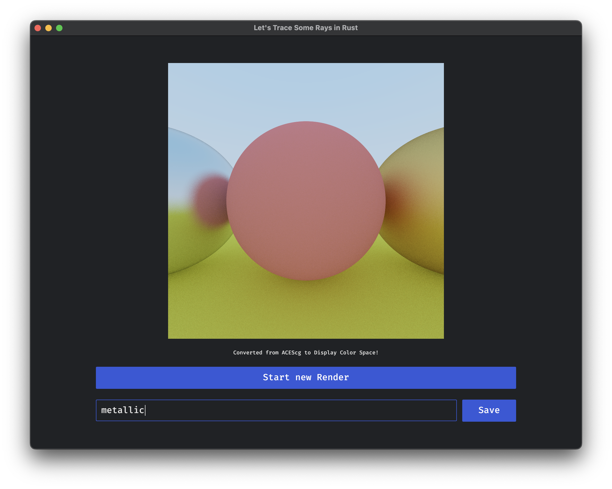

# README

**TL;DR:** This app is a toy Raytracer writter in Rust.

This is just a pet project of mine, done while sloooowly following along [Ray Tracing in One Weekend](https://misterdanb.github.io/raytracinginrust/#surfacenormalsandmultipleobjects) over the course of >1 weekends.

Current features:
- UI: written in [iced](https://iced.rs/), following the [ELM architecture](https://guide.elm-lang.org/architecture/)

- UI: GPU Framebuffer shows a 8bit tonemapped conversion of the render buffer (32bit float) 

- UI: Save to filesystem in OpenEXR container (ZIP compression), thanks to [exr](https://crates.io/crates/exr)

- 3D: Rendering done in scene linear ACEScg colorspace, thanks to [colstodian](https://crates.io/crates/colstodian)

- 3D: Rendering happens in the background via async tasks, thanks to the iced Command API

- 3D: Normals rendering and antialiasing of a simple Sphere (so chapter 8 of RTiOW)

## Things I want to do

- Proper multithreaded rendering, based on the number of cores.
  - Could happen via rayon, or via a bespoke solution.

## Things I have learned so far

- I don't like immediate GUI approaches, like egui (sending data around is too hard, if you don't have a message/event based approach!)

- GUI frameworks in Rust are cool, but still very very young
